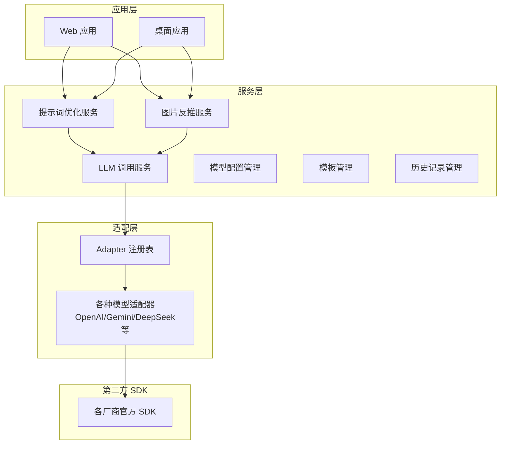
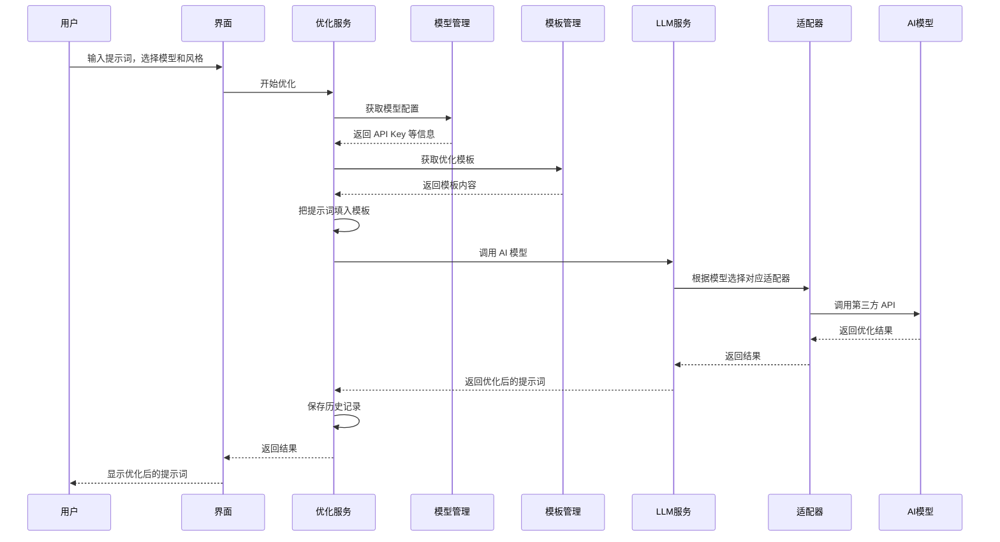
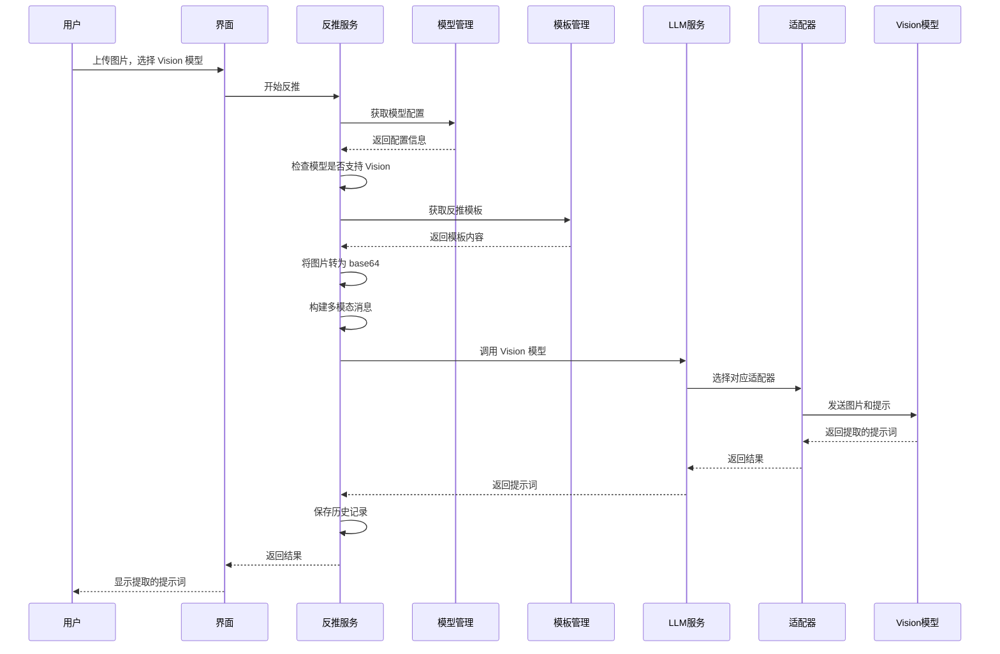

# 项目原理说明

## 是什么

简单来说，这是一个帮你优化提示词和从图片中提取提示词的工具。比如你写了一个简单的提示词"一只猫"，它可以帮助你优化成更专业、更详细的描述，让 AI 画图工具能生成更好的图片。反过来，如果你有一张图片，它也能帮你提取出描述这张图片的提示词。

这个项目最大的特点是可以对接多个 AI 模型厂商，比如 OpenAI、Gemini、DeepSeek 等等。不管你用哪个厂商的模型，使用方式都是一样的，非常方便。

## 整体架构

整个系统分为几层，从用户界面到最底层的第三方 SDK，每一层都有明确的职责。

最上层是应用层，包括 Web 应用和桌面应用。它们都使用相同的核心服务，所以功能完全一致。

中间是服务层，这是整个系统的核心。提示词优化服务和图片反推服务负责具体的业务逻辑，LLM 调用服务负责统一调用各种 AI 模型。模型配置管理负责保存和读取用户的 API Key 等配置信息，模板管理负责管理各种优化风格的模板，历史记录管理负责保存用户的操作历史。

再往下是适配层。这里有个注册表，管理着所有模型的适配器。每个 AI 厂商都有自己的 SDK，调用方式也不一样，适配器的作用就是把不同厂商的 SDK 封装成统一的接口。这样上层代码就不用关心底层是 OpenAI 还是 Gemini 了，直接调用就行。

最底层是各个厂商的官方 SDK，比如 OpenAI 的 SDK、Google 的 SDK 等等。

## 核心设计思路

这个项目采用了 Provider-Adapter-Registry 三层架构。听起来有点复杂，其实很好理解。

**Provider** 就是模型提供商，比如 OpenAI、Gemini 这些。每个提供商都有自己的特点，比如支持的模型列表、API 调用方式等等。

**Adapter** 是适配器，它的作用是把不同厂商的 SDK 封装成统一的接口。比如 OpenAI 的 Adapter 会调用 OpenAI 的 SDK，Gemini 的 Adapter 会调用 Google 的 SDK，但是它们对外提供的接口是一样的。这样上层代码就可以用同样的方式调用不同的模型。

**Registry** 是注册表，管理所有的 Adapter。当你需要调用某个模型时，告诉 Registry 你要用哪个厂商的模型，它就会返回对应的 Adapter。

这种设计的好处是什么呢？如果你想添加一个新的 AI 模型厂商，只需要创建一个新的 Adapter，然后在 Registry 中注册一下，就完事了。不需要修改其他任何代码，这就是所谓的"对扩展开放，对修改关闭"。

## 使用流程

### 提示词优化流程

当你想要优化一个提示词时，整个流程是这样的：

首先，你在界面上输入原始提示词，比如"一只猫"。然后选择要使用的模型，比如 GPT-4，再选择优化风格，比如"通用优化"或"创意优化"。

界面接收到你的输入后，会调用优化服务。优化服务首先从模型管理那里获取你选择的模型配置，包括 API Key、Base URL 等信息。这些配置是你之前保存的，存储在浏览器的本地存储里。

接下来，优化服务会根据你选择的优化风格，从模板管理那里获取对应的模板。模板其实就是预设好的提示词，告诉 AI 模型怎么优化提示词。比如通用优化的模板可能是："你是一个专业的提示词优化专家，请将以下提示词优化得更详细、更专业：{{originalPrompt}}"

优化服务会把你的提示词替换到模板的占位符里，构建成完整的消息。这个消息会包含系统提示和用户提示，系统提示告诉 AI 它的角色和任务，用户提示包含要优化的提示词。

然后优化服务会调用 LLM 服务。LLM 服务会根据模型配置，从注册表找到对应的适配器，适配器再调用对应厂商的 SDK，最终调用 AI 模型的 API。

AI 模型返回优化后的提示词，这个结果会一层层返回，最终显示在界面上。同时，这次操作会被保存到历史记录里，方便你以后查看。

### 图片反推提示词流程

图片反推的流程和提示词优化类似，但有几个关键区别：

首先，你需要上传一张图片，然后选择一个支持 Vision 功能的模型，比如 GPT-4 Vision 或 Gemini Pro Vision。不是所有模型都支持图片输入，所以系统会先检查你选择的模型是否支持 Vision 功能。

接下来，反推服务会获取对应的模板。这个模板会告诉 AI 模型："请从以下图像中提取描述它的提示词"。

然后，系统会把图片转换成 base64 格式，这样才能在 API 请求中传输。构建的消息不是纯文本，而是包含文本和图片的多模态消息。格式大概是这样的：先是一段文字说明，然后跟着图片的 base64 数据。

最后，适配器会调用支持 Vision 的模型 API，模型会分析图片内容，返回描述这张图片的提示词。结果同样会保存到历史记录里。

## 数据存储

项目使用浏览器的 localStorage 来存储数据，所有数据都在本地，不会上传到服务器。这样设计的好处是保护用户隐私，而且不需要后端服务器。

存储的数据主要有两类：

**模型配置**：包括模型提供商的 ID、具体模型的 ID、用户的 API Key、API 的基础地址等信息。每个模型配置都有一个唯一的标识，方便后续调用。

**历史记录**：包括操作类型（是优化还是反推）、操作时间、输入内容（原始提示词或图片）、输出内容（优化后的提示词或提取的提示词）、使用的模型、优化风格等信息。这样你可以随时查看之前的操作记录，也可以删除不需要的记录。

## 模板系统

模板系统是提示词优化的核心。不同的优化风格对应不同的模板，模板定义了如何和 AI 模型对话来优化提示词。

模板的结构很简单，就是一个消息数组，每个消息有角色（system 或 user）和内容。内容里可以用占位符，比如 `{{originalPrompt}}`，实际调用时会被替换成你输入的提示词。

项目内置了几种优化风格：

- **通用优化**：适合大多数场景，会把提示词优化得更详细、更专业
- **创意优化**：强调创意和想象力，适合艺术创作场景
- **摄影优化**：专门针对摄影场景，会加入摄影相关的专业术语
- **中式美学**：强调中式美学风格，适合中国风的作品

每种风格都有对应的模板，你选择风格后，系统会自动使用对应的模板。如果你想要自定义优化风格，也可以创建自己的模板。

## 流式响应

项目还支持流式响应，也就是说 AI 模型返回结果时，不是一次性返回完整内容，而是一块一块地返回。这样你可以看到实时的输出，体验更好。

流式响应的实现原理是：界面调用流式接口，传入回调函数。每次收到数据块时，回调函数会被调用，界面可以实时更新显示。当流结束时，会调用完成回调。

这样你就能看到提示词一个字一个字地出现，而不是等很久才一次性显示完整结果。特别是在优化比较长的提示词时，这个功能很有用。

## 为什么这样设计

这个架构设计有几个好处：

**可扩展性强**：如果你想添加新的 AI 模型厂商，只需要创建一个新的 Adapter，然后在 Registry 中注册一下，就完事了。不需要修改其他任何代码。

**可维护性好**：清晰的层次结构，每一层都有明确的职责。如果某个功能出问题了，很容易定位到是哪一层的问题。

**多端支持**：核心服务层可以复用于 Web、桌面、插件等不同场景。只要实现了对应的界面层，就能使用相同的核心功能。

**类型安全**：使用 TypeScript 提供完整的类型支持，开发时就能发现很多潜在的错误。

**用户体验好**：支持流式响应，可以实时看到结果。历史记录功能让你可以随时查看之前的操作。

## 总结

这个项目的核心思想就是通过分层架构和适配器模式，把不同 AI 厂商的差异封装起来，对外提供统一的接口。这样你可以用同样的方式调用不同的模型，开发者也可以轻松添加新的模型支持。

整个系统设计得比较清晰，职责分明，扩展性强。无论是添加新功能还是支持新模型，都不会影响现有代码，这在实际开发中很重要。如果你想要一个简单易用的提示词优化工具，这个项目应该能满足你的需求。
